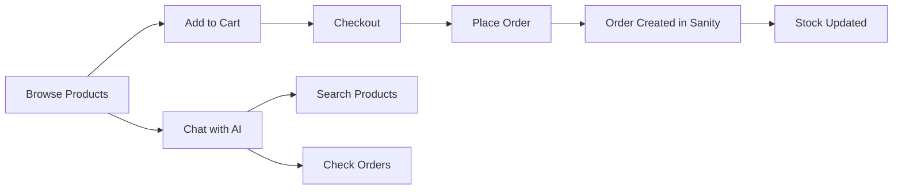
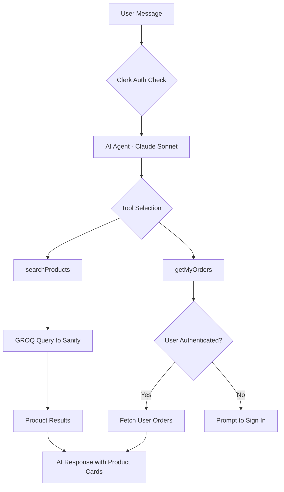
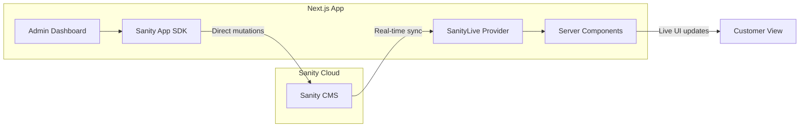

<!-- Badges -->

# 🏋️ AI-Powered Gym Memebership + E-commerce Platform

> Built for Gold's Gym Bangladesh and Zulcan Indoor Arena, with an AI shopping assistant, real-time inventory updates, and a powerful admin dashboard.

---

## 👇🏼 Customer Journey (Storefront)
1) Customer Journey (Storefront)
Home → show hero, trainings, favorites tabs, testimonials, Instagram strip.
Shop → use filters, category tabs, pagination; open a product.
Product detail → options/variants, stock, add to cart.
Cart → adjust quantity, free‑shipping progress, proceed to checkout.
Checkout → apply discount, place order (COD), see success page.

2) Membership Flow
Packages page → select location/tier → “Join Now”.
Membership checkout (/packages/checkout?package=...) → fill info, submit.
My Subscription → verify current membership card + trainings section + history.

3) Admin Management
Admin login (PIN) → dashboard cards + insights.
Inventory → verify products, open product edit.
Orders → view new order, change status (Preparing/Shipped/etc).
Packages → edit membership packages.
Subscriptions → view recent membership signup, update status.
Trainings → edit training items.
Inquiries → check contact submissions, update status.

4) Data Verification
Sanity Studio → confirm products, categories, packages, subscriptions, trainings.
Admin pages → confirm data matches Studio.
---

## 🤔 What Is This Application?

**Think of it as a modern ecommerce store and gym membership system with a brain.**

This is a full-featured e-commerce platform where customers can:

- 🛒 **Browse & Buy** — Shop supplements, activewear, equipment, and combat gear with live stock updates
- 🤖 **Chat with AI** — Ask the AI assistant to find products, check prices, or track orders
- 📦 **Track Orders** — View order history and delivery status (when signed in)

And store owners get:

- 📊 **AI-Powered Insights** — Dashboard with sales trends, inventory alerts, and action items
- ✏️ **Real-time Editing** — Manage products and orders with instant updates via Sanity App SDK
- 🔔 **Smart Alerts** — Low stock warnings and unfulfilled order notifications

### Key Concepts Implemented

| Term | What It Means |
|------|---------------|
| **CMS (Content Management System)** | Where all your products, orders, and content live — in this case, Sanity |
| **Real-time Content** | When you update a product in Sanity, it instantly appears on the website |
| **AI Shopping Assistant** | A chatbot powered by Claude AI that can search products and check your orders |
| **App SDK** | Sanity's toolkit for building custom applications with direct database access |

---

## 🎯 Techstack implemented

✅ **Next.js 16** with App Router & Server/Client Components + Server Actions!

✅ **Clerk authentication** with AgentKit for AI-aware user context!

✅ **Sanity CMS** with App SDK for real-time data mutations & live content updates!

✅ **Vercel AI SDK** with AI Gateway for multi-provider LLM support (Claude, GPT, Cohere)!

✅ **Cash on delivery checkout** with full address collection!

✅ **shadcn/ui + Tailwind CSS v4** for beautiful, accessible UI components!

✅ **Zustand state management** with localStorage persistence for cart!

✅ **Mobile-responsive design** with modern layouts & dark mode!

✅ **AI Shopping Assistant** with custom tools for product search & order tracking!

✅ **AI Admin Dashboard** with Claude-powered insights, sales trends & recommendations!

✅ **GROQ queries** with TypeGen for type-safe Sanity data fetching!

✅ **Real-time UI updates** via Sanity Live — no polling required!

✅ **Custom AI tools** scoped to authenticated users (orders only visible when signed in)!

✅ **Order creation** with automatic stock management!

✅ **Embedded Sanity Studio** for content management at `/studio`! + SO MUCH MORE!

---

## ✨ Features

### For Shoppers

| Feature | Description |
|---------|-------------|
| 🤖 **AI Shopping Assistant** | Natural language product search, filter by brand/goals/sports/gender/options, get recommendations |
| 📦 **Order Tracking** | View your order history and status (requires sign-in) |
| 🛒 **Smart Cart** | Persistent cart with real-time stock validation |
| 💳 **Checkout** | Cash on delivery with address collection |
| 🔄 **Real-time Stock** | See live inventory levels — no surprises at checkout |

### For Admins

| Feature | Description |
|---------|-------------|
| 🧠 **AI Dashboard Insights** | Sales trends, inventory alerts, and actionable recommendations powered by Claude |
| 📝 **Product Management** | Create, edit, and publish products directly via Sanity App SDK |
| 📋 **Order Management** | Update order status (COD ↔ paid) |
| ⚠️ **Low Stock Alerts** | Automatic warnings when inventory runs low |
| 📊 **Analytics** | Revenue tracking, order counts, and performance metrics |

### Technical Features (The Smart Stuff)

| Feature | Technology | Why It Matters |
|---------|------------|----------------|
| ⚡ **Real-time Updates** | Sanity Live + App SDK | Content changes appear instantly without refresh |
| 🔐 **Authenticated AI** | Clerk AgentKit | AI assistant knows who you are and can access YOUR orders |
| 🧠 **AI Gateway** | Vercel AI Gateway | Use Claude, GPT, or other models — easily swappable |
| 🛒 **Persisted Cart** | Zustand + localStorage | Cart survives page refreshes and browser restarts |
| 📱 **Responsive Design** | Tailwind CSS + Shadcn/UI | Beautiful UI on any device |
| ⚙️ **Type Safety** | TypeScript + Sanity TypeGen | Auto-generated types from your CMS schema |

---

## 🔄 How It Works

### User Shopping Flow

### AI Assistant Architecture

### Real-time Data Flow

